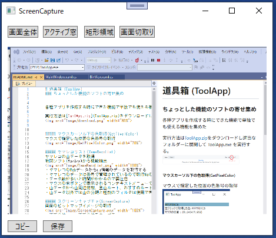
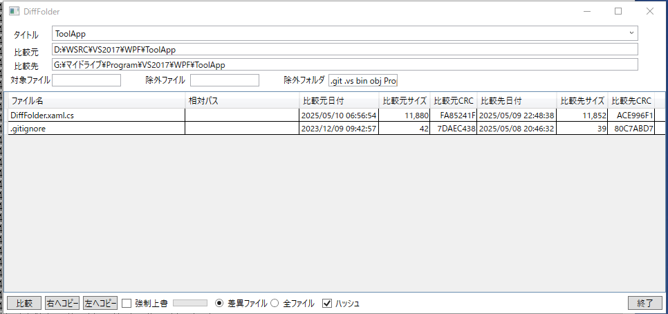

# 道具箱 (ToolApp)
### ちょっとした機能のソフトの寄せ集め

各種アプリを作成する時にできた機能で単独でも使える機能を集めた  

実行方法は[ToolApp.zip](ToolApp.zip)をダウンロードし適当なフォルダーに展開して ToolApp.exe を実行する。  

### マウスカーソル下の色取得(GetPixelColor)
マウスで指定した位置の色番号の取得  

### ヤマレコリスト(YamaRecoList)
ヤマレコの山データを取得  
地図ソフト(MapApp)から機能抽出  

・ヤマレコのWebデータから山情報のデータを取得する  
・ヤマレコのデータは番号で管理されているので取得Noのテキストボックスに開始番号と終了番号を入れてデータ取得のボタンを押すとデータがダウンロードされる。  
・データ数が多いと時間がかかるので要注意  
・マウスの右ボタンで表示されるコンテキストメニューで操作する  
・山データから山周辺情報、登山ルート、おすすめルートが抽出できる  
・山データ以外では山の分類と種別のフィルタは使用できない  

### スクリーンキャプチャ(ScreenCapture)
画面のビットマップイメージの取得  

・画面全体　　: 画面全体をキャプチャ  
・アクティブ窓:アクティブウィンドウをキャプチャ  
・矩形領域　　: マウスで指定した領域をキャプチャ  
・画面切取り　: 矩形領域と同じだが処理方法が異なる    

### サムネイル表示(PhotoView)
写真ファイルを一覧表示して写真の属性データを表示  
地図ソフト(MapApp)から機能抽出  

・ファイルパスのコンボホックスをマウスでダブルクリックしてフォルダを選択する。  
・データを選択してマウスの右ボタンで表示されるコンテキストメニューから次の機能が使える  
　開く
　表示 : 別にダイヤログを開いて表示  
　座標入力 : 数値で緯度経度を入力して写真ファイルに位置情報を書き込む
　GPS座標追加 : GPSのログファイル(GPX/FIT)を参照して写真ファイルに位置情報を書き込む
　コメント登録 : 写真ファイルにコメント情報を書き込む
　属性表示 : 写真ファイルの属性情報を表示  
※ 座標入力、GPS座標追加、コメント登録はファイルを変更するのでバックアップを取ったうえで使用してください。

### フォト一覧(PhotoList)
写真ファイルを一覧表示して写真のGPS情報の取得と設定  
地図ソフト(MapApp)から機能抽出  

・ファイルパスのコンボホックスをマウスでダブルクリックしてフォルダを選択する。  
・データを選択してマウスの右ボタンで表示されるコンテキストメニューから次の機能が使える  
　開く
　表示 : 別にダイヤログを開いて表示  
　座標入力 : 数値で緯度経度を入力して写真ファイルに位置情報を書き込む
　GPS座標追加 : GPSのログファイル(GPX/FIT)を参照して写真ファイルに位置情報を書き込む
　コメント登録 : 写真ファイルにコメント情報を書き込む
　属性表示 : 写真ファイルの属性情報を表示  
※ 座標入力、GPS座標追加、コメント登録はファイルを変更するのでバックアップを取ったうえで使用してください。

### フォルダ比較(DiffFolder)
2つのフォルダのファイルを比較する  

・比較元と比較先のコンボボックスをダブルクリックするとフォルダ選択のダイヤログが表示される。  
・タイトルを入れて「比較」ボタンを押すと設定が表示れる  
・ハッシュのチェックを入れて比較するとファイルの内容で差異の有無を確認し、入れないとサイズと日付で差異の有無を確認する。  
・ハッシュにチェックを入れると比較に時間がかかる。  
・対象ファイル、除外ファイル、除外フォルダのフィルタにはスペース区切りで複数のワイルドカード(*.txtなど)が設定できる

### FIT読込(FitConverter)
FITファイルのGPS情報を取得する  

・ファイルパスのコンボホックスをマウスでダブルクリックしてファイルを選択して読込ボタンを押す。  
・読み込んだデータはGPXまたはCSV形式で保存  

### バイナリビューワ(BinView)
バイナリファイルのデータを表示する  

・ファイルパスのコンボホックスをマウスでダブルクリックしてファイルを選択する。  
・データの表示開始位置、一行の表示データバイト数、表示形式、エンディアンの選択で表示内容が変更できる
・表示形式:byte, ascii, int8, int16, int32, int64, float, double, 時間, 度1, 度2  
　時間 : 1990/1/1 を基準に1秒単位で表す(FIT形式)  
　　　　var baseDate = new DateTime(1989, 12, 31, 0, 0, 0);  
　　　　DateTime dt = baseDate.AddSeconds(BitConverter.ToUInt32(byteData, 0));  
　　　　buf = dt.ToString("yyyy/MM/dd HH:mm:ss");   
　度1 :  座標データ(秒→度)  
　　　　buf = ((double)BitConverter.ToUInt32(byteData, 0) / 3600).ToString().PadLeft(charCount);  
　度2 :  座標データ(緯度・経度(semicircle→度))(FIT形式)  
　　　　buf = ((double)BitConverter.ToUInt32(byteData, 0) / Math.Pow(2, 31) * 180).ToString().PadLeft(charCount);  
・メモ機能　解析の補助としてメモができる。エディタ内では数式を選択してコンテキストメニューから計算や16－10進変換も可能  

### ■履歴
2025/05/13 バイナリビューワのエンディアンなどのバグ修正  
2025/05/12 バイナリビューワのメモ機能に16進演算機能を追加  
2025/05/11 バイナリビューワにメモ機能追加  
2025/05/10 フォルダ比較追加  
2025/05/08 バイナリビューワ追加して登録  

### ■開発環境  
開発ソフト : Microsoft Visual Studio 2022  
開発言語　 : C# 7.3 Windows アプリケーション  
フレームワーク　 : .NET framework 4.8  
自作ライブラリ  : WpfLib  